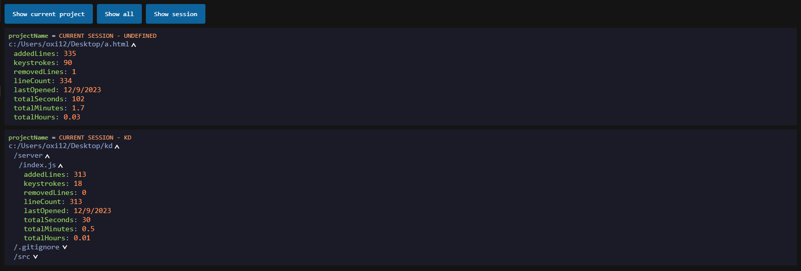

# time-counter README

Time-Counter is a simple VSCode extension aimed to give you basic knowledge about your use times, such as keystrokes, added and removed lines or time spent on a file or project.

## Features

The extensions comes with the following features:
- Tracking time spent on a project and/or single file
- Tracking added and deleted lines
- Tracking keystrokes in a file

## Requirements

- Active internet connection

## Release Notes

Users appreciate release notes as you update your extension.

### 1.0.0

Initial release of Time-Counter

### 1.1.1

The directory holding the time-counter.json file now creates properly if it does not exist
Changed the project logo